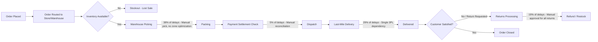
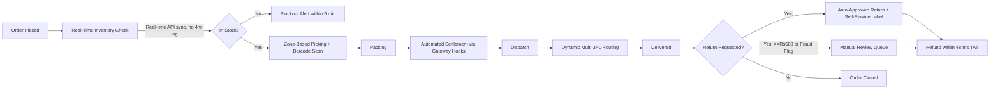
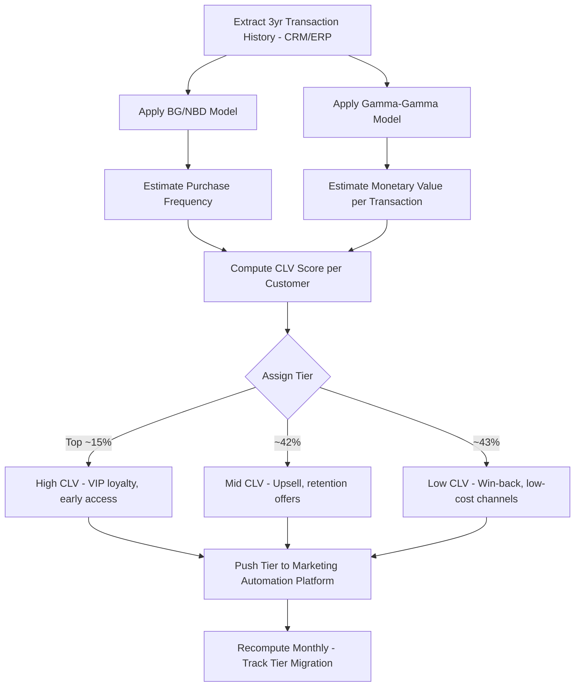
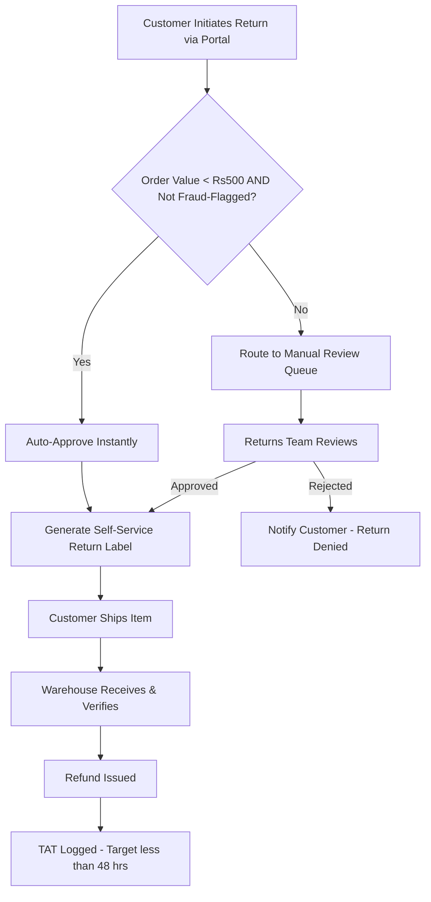

# Process Flows

## 1. Order-to-Delivery Process Flow (As-Is, with Bottlenecks Marked)

## 2. Order-to-Delivery Process Flow (To-Be, Redesigned)

## 3. CLV Segmentation Process Flow

## 4. Returns Process Flow (Detail)

## 5. Root Cause Analysis Method

Bottleneck root causes were derived using the **5-Why technique** supplemented by **Fishbone (Ishikawa) diagrams** built in stakeholder workshops with warehouse managers and logistics coordinators, cross-referencing WMS event logs against the ERP order management module.

| Bottleneck | 5-Why Summary |
|---|---|
| Warehouse Picking | No zone optimization → pickers walk full warehouse → manual process not redesigned → no investment prioritized → root cause: lack of zone-based WMS configuration |
| Last-Mile Delivery | Single 3PL → no failover during demand spikes → contract structured for one vendor → root cause: vendor concentration risk never addressed |
| Returns Processing | All returns need manual approval → no value-based routing rule exists → policy designed for fraud prevention without segmentation → root cause: no auto-approval threshold defined |
